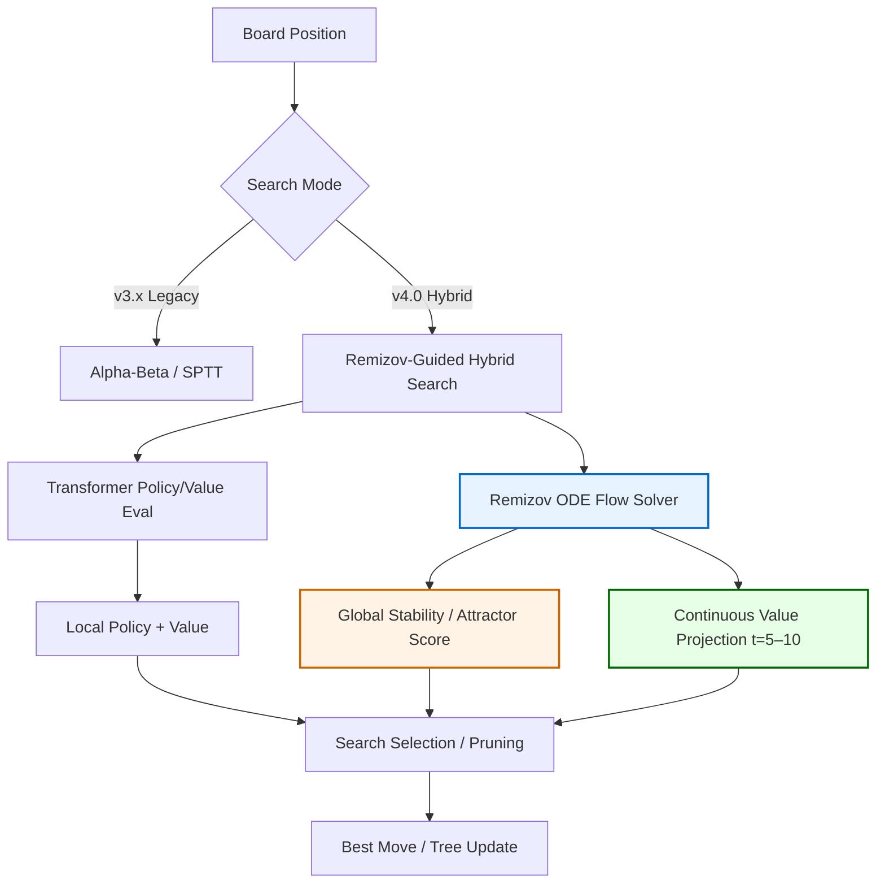

# NikolaChess Roadmap  
## v4.0 — NIKOLA 2.0 (Neural-Symbolic Engine with Continuous-Time Reasoning)

This document outlines the strategic and technical development plan for **NikolaChess** as it transitions from a high-performance NNUE engine into a **Neural-Symbolic chess engine** with **continuous-time evaluation dynamics** and analytic stability guarantees.

---

## 📍 Current Status

- **Current Stable**: v3.21.0  
- **Playing Strength**: ~3850 estimated Elo
- **Architecture**: NNUE + Alpha-Beta / SPTT Hybrid  
- **Language**: 100% MindLang  
- **Execution**: Deterministic, GPU-native

---

## 🎯 Vision & Motivation

Modern engines — whether alpha-beta based or neural MCTS (Lc0 / KataGo) — excel tactically but still struggle with **stability reasoning** in positions that are:

- Theoretically drawn but evaluated as winning  
- Fortress-like with no clear breakthrough  
- Long-horizon but shallow in search depth  

We call these **Neural Blind Spots**.

NikolaChess v4.0 addresses this fundamental gap by treating evaluation **as a continuous flow** over the game state, using **Remizov ODE solvers** as a **search primitive** — not just a heuristic addition.

Instead of asking *“What is the best move now?”*, Nikola asks:  
> **Where does this position converge?**  
> Is its evaluation an attractor, or a transient illusion?

This roadmap defines the technical path to that architecture.

---

## 🧠 Architecture Overview

*(Rendered using GitHub-native Mermaid support)*

**Flow Explanation**:
- **Transformer** → fast, local pattern intuition  
- **Remizov ODE Solver** → global stability & long-horizon projection  
- **Hybrid Search** → combines both signals for final decisions  

---

## 📐 Key Principles

1. **Continuous-Time Evaluation**  
   Evaluation drift modeled as a differential process — a flow field, not discrete snapshots.

2. **Analytic Attractor Detection**  
   Early identification of fortress/draw stability via ODE convergence criteria.

3. **Neural + Symbolic Harmony**  
   Transformer pattern recognition + Remizov analytic guarantees in one pipeline.

4. **Pragmatic Incrementality**  
   Phased rollout: rollout improvements → infrastructure → hybrid search → full training.

---

## 🛠 Strategic Phases

### Phase 0 — Maintenance & Stabilization
**Timeline**: Ongoing (v3.x LTS)
**Owner**: Core Team

Objectives:
- Long-term support for v3.x  
- Tournament bug fixes  
- WebGPU / multi-platform stabilization  

Deliverables:

| Subphase | Goals | Status |
|--------|------|--------|
| v3.21.x | Feedback fixes, NNUE refresh | In progress |
| v3.22.0 | Backend + time management | Planned |
| Build | ARM64 / Windows improvements | Planned |

---

### Phase 1 — Remizov-Monte-Carlo
**Timeline**: Q1 → Q2 2026
**Owner**: Search + Math Team

Introduce continuous evaluation flow into rollouts.

Deliverables:
- **Remizov-MC Rollouts** — replace 20–50% random playouts with ODE trajectories (`remizov_feynman.mind`)
- **Variance Smoothing** — reduce oscillation in drawish regions
- **Analytic Contempt** — dynamic scaling via attractor strength

---

### Phase 1.5 — Core Infrastructure Refactor
**Timeline**: Q1 → Q2 2026
**Owner**: Core / Infra Team

Targets:

| Component | From | To |
|---------|------|----|
| Move Generation | Scattered | 100% vectorized Mind |
| Position Encoding | NNUE planes | 119-plane tensor |
| Hashing | Zobrist-64 | Zobrist-128 + neural |

Deliverables:
- `board.mind` full rewrite (~2× throughput)
- Tensor runtime consistency across all backends

---

### Phase 2 — Transformer Evaluator  
**Timeline**: Q2 2026  
**Owner**: Neural Team

Goals:
- 16-block Transformer (512 hidden dim)
- Convert ~5B v3.x positions to transformer-ready datasets
- Hybrid inference (Transformer + NNUE fallback)

**Target**: ≥3500 Elo standalone

---

### Phase 3 — Remizov-Guided Hybrid Search  
**Timeline**: Q2 → Q3 2026  
**Owner**: Search + Neural Team  

**This phase defines the core novelty.**

Deliverables:
- **Flow-Field Search** — evaluation treated as a dynamical system  
- **Attractor Pruning** — prune converging-to-draw subtrees analytically  
- **GPU Batching** — 4096+ positions/sec on consumer GPUs  

**Key Insight**  
Unlike standard MCTS (Lc0 / KataGo), decisions are driven by **analytic convergence** (Remizov ODE limits), not just visit counts or neural priors.

This enables **early analytic detection of fortresses and draw convergence**, even in positions where neural networks remain overconfident.

---

### Phase 4 — Self-Play & Evolutionary Training  
**Timeline**: Q3 2026  
**Owner**: Training Team

Deliverables:
- Distributed self-play orchestration in MindLang
- **Inverse Remizov Regularization** — train networks to favor stable attractors
- Automated Elo benchmarking vs Stockfish, Lc0, Torch

**Target**: 4000+ Elo self-play

---

### Phase 5 — Symbolic Layer & Release  
**Timeline**: Q4 2026  
**Owner**: Release + Infra Teams

Deliverables:
- Fortress certification & symbolic proofs
- Universal binaries (Windows, Linux, macOS Metal, Android)
- Full technical whitepaper on Remizov-Guided Search

---

## 📈 Technical Performance Targets

| Metric | v3.21 (Current) | v4.0 (Target) |
|------|------------------|--------------|
| Elo (Consumer GPU) | ~3850 | 4000+ |
| Elo (Cluster) | ~3900 | 4200+ |
| Fortress Detection | Depth-reliant | Analytic / Immediate |
| Endgame Variance | High | Minimal (Smoothed) |
| Neural Blind Spot Reduction | ~10–20% | ≥40–60% |
| Language Runtime | MindLang v1 | MindLang v2-Native |

---

## 📝 Glossary

- **Remizov ODE Solver** — continuous-time framework modeling chess evaluation as a dynamical system  
- **Attractor** — stable convergence point (forced draw or fortress)  
- **Feynman–Kac Formula** — stochastic method used in Remizov-Monte-Carlo rollouts  
- **SPTT** — Speculative Parallel Tree Traversal, a hybrid search method combining alpha-beta with speculative parallel expansion
- **MindLang** — GPU-native, autodiff-enabled language for neural + symbolic systems

---

## 🤝 Contributing

We are actively seeking contributors with experience in:

- MindLang and GPU programming  
- Stochastic calculus / differential equations  
- Transformer optimization & large-scale training  

See the [Issues](https://github.com/star-ga/NikolaChess/issues) tab to get started.

---

**Repository**: https://github.com/star-ga/NikolaChess  
**Last Updated**: February 2026  
© 2026 **STARGA Inc.** All rights reserved.
